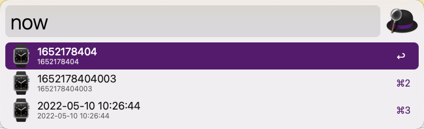
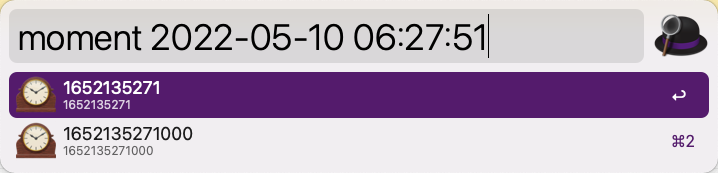
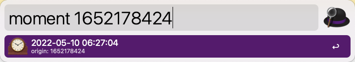

# Alfred Workflow Moment

An Alfred workflow to convert time format and get current time using [Deno](https://deno.land) and [moment.js](https://momentjs.com/).

## Prerequisites

* Install [Deno](https://deno.land).

## Usage

1. Open Alfred App
2. Then:
    - Type `now`, then you can get current time in three formats.
    
    - Type `moment` and a timestamp or a time string, then the converted time is displayed.
    
    

3. You can click the result or type `return` on the result to copy that.